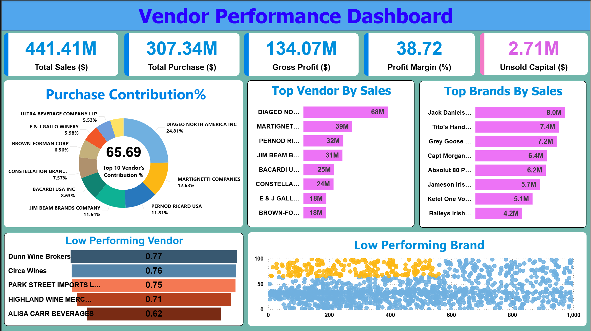

# Vendor Performance Analysis & Dashboard

A comprehensive data analysis and visualization project designed to evaluate vendor and brand performance, optimize inventory, and improve gross profit margins. This project bridges raw procurement and sales data from SQLite into interactive, business-critical insights via a Power BI dashboard.

## Overview & Business Impact

The overarching goal of this analysis was to identify underperforming vendors, pinpoint high-margin brands, and reduce tied-up capital in unsold inventory. The insights generated from this dashboard provide a direct path toward optimizing purchasing strategies and increasing overall profitability.

### Key Performance Indicators (KPIs) at a Glance
- **Total Sales:** $441.41 Million
- **Total Purchases:** $307.34 Million
- **Gross Profit:** $134.07 Million
- **Average Profit Margin:** 38.72%
- **Unsold Capital:** $2.71 Million

By successfully identifying **$2.71M** in tied-up capital and maintaining a strong **~38.7%** profit margin across operations, the analysis highlights specific areas for cost reduction and resource reallocation.

---

## 📊 The Dashboard

### Core Insights Discovered:

1. **Vendor Concentration & Leadership**
   - **Diageo North America Inc.** dominates both sales and purchases, driving **$68M** in sales and contributing to **24.81%** of total vendor purchases.
   - The "Top 10" vendors collectively account for a massive **65.69%** of the entire purchase contribution pie, indicating a highly concentrated supplier reliance.

2. **Brand-Level Profitability**
   - The top 10 brands by sales are heavily weighted toward spirits, led by **Jack Daniels No 7 Black ($8.0M)**, **Tito's Handmade Vodka ($7.4M)**, and **Grey Goose Vodka ($7.2M)**. 
   - Visualizing the *Low Performing Brands* scatter plot reveals a distinct segmentation: A cluster of items (highlighted in yellow/red on the dashboard) possess high profit margins (>50%) but drastically low total sales. *Actionable Growth:* Shifting marketing and shelf-space toward these specific high-margin, low-volume brands could rapidly scale gross profit without linearly scaling costs.

3. **Vendor Efficiency (Low Performers)**
   - Analysis of inventory turnover ratios highlighted bottom-tier vendors causing inventory drag. 
   - Vendors like **Dunn Wine Brokers** (0.77 ratio), **Circa Wines** (0.76 ratio), and **Alisa Carr Beverages** (0.62 ratio) are currently moving product too slowly, directly inflating the $2.71M unsold capital metric.

---

## Technical Workflow

### 1. Data Ingestion & Transformation (Python & SQLite)
* Raw inventory, purchase, and sales CSV files were ingested into a monolithic `inventory.db` SQLite database (`ingestion_db.py`).
* Executed complex SQL aggregations to calculate volume, total purchase dollars, total sales dollars, total excise taxes, freight costs, gross profit, stock turnover, and sales-to-purchase ratios directly querying the database logic.
* Performed deep Exploratory Data Analysis (EDA) in Jupyter Notebooks (`Vendor Performace Analysis.ipynb` & `Explorartory Data Analysis.ipynb`) to test statistical hypotheses, investigate standard deviations, and finalize the `vendor_sales_summary` view.

### 2. Visualization & Dashboarding (Power BI)
* Exported the sanitized and enriched `vendor_sales_summary` dataset.
* Constructed DAX measures for exact KPI tracking (Total Sales, Total Purchases, Margins, Unsold Capital).
* Designed an intuitive, storytelling layout using custom color themes (Blue/Red/Green) to contrast high performers from low performers instantly.
* Implemented interactive Top-N filtering and scatter-plot segmentation to isolate high-margin "sleeper" brands.

## How to Run

1. Ensure Python 3.x is installed along with `pandas`, `sqlite3`, `matplotlib`, and `seaborn`.
2. Run `ingestion_db.py` to compile the raw CSVs into the structured `inventory.db` (Raw data files excluded from repo due to size).
3. Open `Vendor Performace Analysis.ipynb` to view the Python analytical logic and export the final dataset.
4. Open the provided `.pbix` Power BI file to interact with the dashboard directly.
